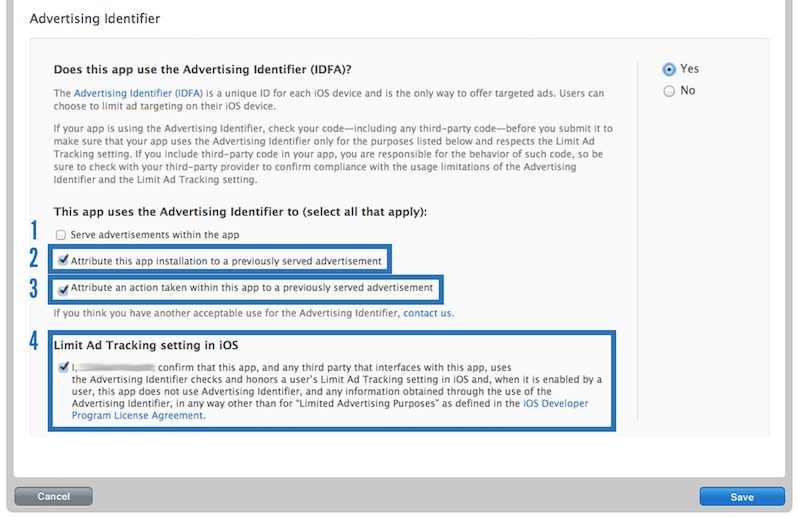

## iOS Analytics ユーザーガイド

**analytics** モジュールはイベントを追跡するためのAPIを提供し、ライフサイクルイベントの一部を自動的にRakuten Analytics Tracker (RAT) サービスに送信します。

詳細については、[高度な使用法](../../category/advanced-usage-1)をご参照ください。

## 必要条件

このモジュールはiOS 12.0以降をサポートしています。iOS 12.5以降でテストされています。サポートされる最小バージョンは、OSバージョンの使用状況に基づいて毎年更新されます。

Xcode >= 14.1 がサポートされています。  
Swift >= 5.7.1 がサポートされています。

注意: SDKは以前のXcodeバージョンでビルドできる場合がありますが、公式にはサポートまたはテストされていません。

## インストール方法

### CocoaPods

デフォルトの構成でモジュールを使用するには、`Podfile` に以下を含める必要があります:

```ruby
pod 'RakutenAnalytics'
```

`pod install` を実行してモジュールとその依存関係をインストールします。

### Swift Package Manager

Xcodeのプロジェクト設定を開き、「Swift Packages」タブで新しいパッケージを追加します:

- リポジトリURL: `https://github.com/rakutenanalytics/ios-rakutenanalytics.git`
- バージョン設定: 10.5.0 "Up to Next Major"

ターゲットに `RakutenAnalytics` 製品を選択します。他のターゲット（Notification Service Extension、Notification Content Extensionなど）にリンクしたい場合は、そのターゲットの Build Phases に移動し、Link Binary With Libraries で + ボタンをクリックして `RakutenAnalytics` を追加します。

### アプリでモジュールをインポートする

#### Swift

```swift
import RakutenAnalytics
```

#### Objective-C

```objective-c
@import RakutenAnalytics;
```

### RAnalytics から RakutenAnalytics への移行

現在、`RAnalytics` と `RakutenAnalytics` の間に大きなAPIの変更や違いはありません。移行プロセスは、依存関係の再インストールとインポートの更新に関連しています。

#### CocoaPods

CocoaPodsを使用して `RAnalytics` から `RakutenAnalytics` に移行するには、`Podfile` の依存関係を以下のように変更してください:

```ruby
pod 'RAnalytics'
```

を:

```ruby
pod 'RakutenAnalytics'
```

に変更し、`pod install` コマンドを実行して依存関係をインストールします。

#### Swift Package Manager

Swift Package Managerを使用して `RAnalytics` から `RakutenAnalytics` に移行するには、Xcodeのプロジェクト設定を開き、Xcodeプロジェクトから `RAnalytics` 依存関係を削除します。その後、以下のパッケージURLを使用してください:

`https://github.com/rakutenanalytics/ios-rakutenanalytics.git`

以前のURL:

`ssh://git@gitpub.rakuten-it.com:7999/eco/core-ios-analytics.git`

#### モジュールインポート

`RakutenAnalytics` をインストールした後、プロジェクト内のモジュールインポートを以下のように更新してください:

```swift
import RAnalytics
```

を:

```swift
import RakutenAnalytics
```

に変更します。

## 設定

### 認証情報

Rakuten Analytics Trackerを使用してイベントを追跡するには、RATアカウントIDとアプリケーションIDが必要です。

### ビルド時の設定

アプリケーションは、`Info.plist` に以下のように `RATAccountIdentifier` を設定する必要があります:

| Key | Value |
| -------- | -------- |
| `RATAccountIdentifier` | `YOUR_RAT_ACCOUNT_ID` (Number型) |
| `RATAppIdentifier` | `YOUR_RAT_APPLICATION_ID` (Number型) |

`RATAppIdentifier` はオプションのキーです。指定されていない場合、デフォルト値は `1` に設定されます。

その他:

- アプリの `Info.plist` に `RATAccountIdentifier` キーがない場合、RakutenAnalytics SDK は **DEBUGモード** で **例外をスロー** します。
- アプリの `Info.plist` に `RATAccountIdentifier` キーがない場合、RakutenAnalytics SDK のトラッキングは **RELEASEモード** で **無効** になります。

### Kibanaを使用して統合の成功を確認する

Kibana STGおよびPRODサイトを使用して、アプリが送信したイベントを確認できます。

アプリのすべての分析データを見つけるには、アプリケーション識別子 `aid:<your app id>` または `app_name:<your bundle id>` を検索します。

特定のイベントタイプ（[標準イベント](./ios-user-guide#standard-events)の1つなど）のデータを見つけるには、検索クエリに `etype` を追加します。例: `aid:999 AND etype:_rem_launch`。

## SDKの使用

### ログインの処理

ログインおよびログアウトイベントを正しいメンバー識別子で追跡するには、メンバー識別子を手動で設定および解除する必要があります。ほとんどの場合、メンバー識別子として設定する値はメンバーの識別子であるべきです。メンバー識別子はIDSDK IDトークンから抽出するか、`String` 値として渡すことができます。

ユーザーのメンバー識別子をRakutenAnalytics SDKに通知するには、`setMemberIdentifier` を使用します。

```swift
AnalyticsManager.shared().setMemberIdentifier(%member_identifier%)
```

注意: メンバー識別子を設定することで、`_rem_login` が自動的に追跡されます。

### ログイン失敗の処理

ユーザーのログインが失敗した場合、`setMemberError` を使用してRakutenAnalytics SDKに通知します:

```swift
AnalyticsManager.shared().setMemberError(error)
```

注意: メンバーエラーを設定することで、`_rem_login_failure` が自動的に追跡されます。

### ログアウトの処理

ユーザーがログアウトした場合、`removeMemberIdentifier` を使用してRakutenAnalytics SDKに通知します:

```swift
AnalyticsManager.shared().removeMemberIdentifier()
```

注意: メンバー識別子を削除することで、`_rem_logout` が自動的に追跡されます。

### 標準イベントの追跡

イベントは `RAnalyticsEvent#initWithName:parameters:` を使用して作成され、トラックメソッドを呼び出すことでスプールされます。

#### 一般的なイベントの追跡

一般的なイベントの追跡は、現在登録されているイベントを処理できるトラッカーに依存します。

```swift
AnalyticsManager.Event(name: "my.event", parameters: ["foo": "bar"]).track()
```

#### RAT固有のイベントの追跡

具体的なトラッカー `RAnalyticsRATTracker` が自動的に登録され、**Rakuten Analytics Tracker (RAT)** と連携します。`RAnalyticsRATTracker#eventWithEventType:parameters:` を使用して、RATによってのみ処理されるイベントを作成することもできます。

> **注意:** SDKは、`acc`、`aid`、`etype`、`powerstatus`、`mbat`、`dln`、`loc`、`mcn`、`model`、`mnetw`、`mori`、`mos`、`online`、`cka`、`ckp`、`cks`、`ua`、`app_name`、`app_ver`、`res`、`ltm`、`ts1`、`tzo`、`userid`、`ver` などの多くのRATパラメータを自動的に追跡します。

```swift
RAnalyticsRATTracker.shared().event(eventType: "click", parameters:["pgn": "coupon page"]).track()
```

> `acc` と `aid` のデフォルト値を上書きするには、イベント作成時に `parameters` 辞書にこれらのキーを含める必要があります。

> **注意:** `acc` と `aid` は **整数** でなければなりません。

```swift
RAnalyticsRATTracker.shared().event(eventType: "click", parameters:["acc": 123, "aid": 456]).track()
```

### 標準イベント

SDKは、特定のアクションに対してRakuten Analytics Trackerにイベントを自動的に送信します。これらのイベントのイベントタイプパラメータはすべて `_rem_` で始まります。すべてのイベントに対して名前付き定数も提供しています。

| イベント名 | 説明 |
| -------- | -------- |
| `_rem_init_launch` | アプリケーションが初めて起動されました。 |
| `_rem_launch` | アプリケーションが起動されました。 |
| `_rem_end_session` | アプリケーションがバックグラウンドに移行しました。 |
| `_rem_update` | アプリケーションが起動され、そのバージョン番号が前回の起動時のバージョン番号と一致しません。 |
| `_rem_login` | ユーザーが正常にログインしました。 |
| `_rem_logout` | ユーザーがログアウトしました。 |
| `_rem_install` | アプリケーションバージョンが初めて起動されました。 |
| `_rem_visit` | 新しいページが表示されました。アプリケーション開発者は、必要に応じてこのイベントを手動で発行することもできます。 |
| `_rem_applink` | アプリケーションがディープリンクから開かれました。 |
| `_rem_push_received` | アプリがバックグラウンドまたはフォアグラウンドにある間にプッシュ通知が受信されました。 |
| `_rem_push_notify` | アプリがアクティブな間にプッシュ通知が開かれた場合、またはプッシュ通知からアプリが開かれた場合。 |
| `_rem_push_auto_register` | PNP自動登録が発生しました。 |
| `_rem_push_auto_unregister` | PNP自動登録解除が発生しました。 |

#### 必要条件

以下の表は、**analytics** モジュールによって自動的に追跡される各標準イベントの必要なコンポーネントを示しています。

| イベント名 | 必要なコンポーネント |
| -------- | -------- |
| `_rem_login` | **authentication** モジュール (3.10.1以降)。 |
| `_rem_logout` | **authentication** モジュール (3.10.1以降)。 |

#### 自動生成される状態属性

SDKはデバイスの状態に関する特定の属性を自動的に生成し、イベントを処理するように要求されたときにすべての登録済みトラッカーに渡します。

### iOS拡張機能でのイベント追跡

#### 警告

iOS拡張機能でイベントを追跡するためにAnalyticsManagerシングルトンを直接呼び出さないでください。以下の問題が発生します:

- メンバー識別子などのパラメータが欠落する
- 不正確なエンドポイントURL

iOS拡張機能イベント追跡機能を使用してください。

#### iOS拡張機能イベント追跡機能の使用方法

iOS拡張機能イベント追跡を有効にするには、**メインアプリ** で以下のプロパティを設定します:

```swift
AnalyticsManager.shared().enableExtensionEventTracking = true
```

その後、以下の関数を使用してiOS拡張機能でイベントを追跡できます:

```swift
AnalyticsEventPoster.post(name: "myEventName", parameters: ["key1": "value1"])
```

### `UIKit` の `UIViewController` でのイベント追跡

ページ訪問イベント (etype = `pv`) は、`UIViewController` インスタンスに対して自動的に追跡されます。

#### `UIViewController` の制限

以下の `UIViewController` サブクラスではページ訪問イベントは追跡されません:

- `UINavigationController`
- `UISplitViewController`
- `UIPageViewController`
- `UITabBarController`

#### `UIView` の制限

`UIViewController` のビュータイプが以下の場合、ページ訪問イベントは追跡されません:

- `UIAlertView`
- `UIActionSheet`
- `UIAlertController`

#### その他の制限

- Appleのプライベートクラスはページ訪問イベントとして追跡されません。
- `UIView` のウィンドウプロパティタイプは `UIWindow` クラスの一種でなければなりません。

### SwiftUIビューでのイベント追跡

SwiftUIアプリでページ訪問イベント (etype = `pv`) を追跡するには、SwiftUIビューのbodyで以下の関数を呼び出します:

```swift
public func rviewOnAppear(pageName: String, perform action: (() -> Void)? = nil) -> some View
```

この関数は内部的にSwiftUIの `onAppear` を呼び出します。  
https://developer.apple.com/documentation/SwiftUI/AnyView/onAppear%28perform:%29

例:

```swift
struct ContentView: View {
    var body: some View {
        NavigationView {
            VStack {
                NavigationLink(destination: PageView()) {
                    Text("Page 1")
                }
                NavigationLink(destination: PageView()) {
                    Text("Page 2")
                }
            }.rviewOnAppear(pageName: "contentView") {
            }
        }
    }
}
```

### UIインタラクション

以下のコードは、ボタンクリックを追跡するために使用できる例です。RATの標準 `click` イベントを使用し、ページ名、クリックされた要素のID、ゴールIDをそれぞれ `pgn`、`target`、`gol` パラメータに渡します。

```swift
@IBAction func buttonTapped(sender: UIButton) {
    RAnalyticsRATTracker.shared().event(eventType: "click",
                                        parameters:["pgn": "Main",
                                                    "target": "search_btn",
                                                    "gol": "goal123456"]).track()
}
```

### カスタムイベントの追跡

**注意:** これらの例は、RAT固有のパラメータを送信するために `RAnalyticsRATTracker` を使用しています。カスタムトラッカーを使用している場合は、`RAnalyticsEvent` を使用する必要があります。

以下は、カスタムパラメータを使用してイベントを追跡する例です。以前の例で使用された標準の `pv` RATイベントを使用し、RATがこの目的で受け入れる `cp` 辞書内にいくつかのカスタム `custom_param_##` パラメータを渡します。

```swift
RAnalyticsRATTracker.shared().event(eventType: "pv",
                                    parameters:["pgn": "Main",
                                                "cp": ["custom_param_1": "value",
                                                       "custom_param_2": 10,
                                                       "custom_param_3": true]]).track()
```

## サンプルアプリ

* サンプルアプリのパス: `Sample/RakutenAnalyticsSample.xcodeproj`

## App Store 提出手順

Appleは、アプリケーションをApp Storeにリリースする際に **広告識別子 (IDFA) の使用を開示する** ことを要求しています。

*IDFA使用開示*

#### 1. アプリ内で広告を提供する

アプリに広告が含まれている場合、このボックスをチェックします。

#### 2. このアプリのインストールを以前に提供された広告に帰属させる

このチェックボックスをオンにします。Rakuten SDKはインストール帰属のためにIDFAを使用します。

#### 3. このアプリ内で行われたアクションを以前に提供された広告に帰属させる

このチェックボックスをオンにします。Rakuten SDKは再エンゲージメント広告の帰属のためにIDFAを使用します。

#### 5. iOS制限付き広告トラッキング

Rakuten SDKは以下のApple要件を完全に遵守しています:

広告トラッキングを実行する前に、このプロパティの値を確認してください。値がNOの場合、広告識別子を以下の目的でのみ使用してください: フリークエンシーキャッピング、コンバージョンイベント、一意のユーザー数の推定、セキュリティおよび不正検出、デバッグ。

Rakuten SDKは、`コンバージョンイベント、一意のユーザー数の推定、セキュリティおよび不正検出` のためにのみIDFAを使用します。

## トラブルシューティング

### use_frameworks! を使用せずにプロジェクトをビルドする方法

RakutenAnalyticsはSwiftフレームワークであり、カスタムモジュールマップを含んでいます。

アプリのPodfileに `use_frameworks!` が定義されていない場合、以下のCocoapodsエラーが発生します:

> `Using Swift static libraries with custom module maps is currently not supported.`

この問題を解決するには:

1. Podfileに `cocoapods-user-defined-build-types` プラグインを追加します。
2. 以下のように `RAnalytics` とその依存関係を `static_framework` として宣言します:

```ruby
plugin 'cocoapods-user-defined-build-types'
enable_user_defined_build_types!

target 'MyApp' do
  pod 'RAnalytics', :build_type => :static_framework
end
```

**注意:** `cocoapods-user-defined-build-types` プラグインはサードパーティによって開発されており、そのサポートが継続されることを保証するものではありません。

### RakutenAnalytics Swift Package チェックアウトのヒント

RakutenAnalytics Swift Package をXcodeでチェックアウトできない場合、以下の2つのコマンドラインを実行してください:

```bash
/usr/libexec/Plistbuddy -c "Add :IDEPackageSupportUseBuiltinSCM bool 1" ~/Library/Preferences/com.apple.dt.Xcode.plist
xcodebuild -scheme MyScheme -resolvePackageDependencies -usePackageSupportBuiltinSCM
```

## FAQ

### モジュールのビルドと実行

* [iOS analytics リポジトリ](https://github.com/rakutenanalytics/ios-analytics) をクローンまたはフォークします。
* リポジトリフォルダに `cd` します。
* `bundle install --path vendor/bundle` を実行します。

#### ユニットテスト

* 依存関係をインストールするには `bundle exec pod install` を実行します。
* Xcodeで `UnitTestApp.xcworkspace` を開き、ビルド/実行します。

#### App Store用アプリのビルド

Xcode 13では、アプリのバージョン番号管理を自動的に行うオプションが導入されました（デフォルトで有効）。このオプションを有効にしてアプリをエクスポートすると、Analytics SDKのフレームワークバージョントラッキング機能が壊れます。

App Store用にエクスポートする際は、Xcode UIで「Manage Version and Build Number」オプションを無効にしてください。このオプションを有効のままにする場合、埋め込まれたSDK/フレームワークのバージョンをSDKが追跡できなくなることに注意してください。

### 同じプロジェクトでRakutenAnalyticsとRAnalyticsの依存関係を処理する

プロジェクトに `RakutenAnalytics` と `RAnalytics`（他のフレームワークの一部として）の両方の依存関係が含まれている場合、以下のような問題が発生する可能性があります:

```swift
import RakutenAnalytics
import %SomeFrameworkWithRAnalyticsDependency%

let analyticsManager = AnalyticsManager.shared() // ERROR: Ambiguous use of 'shared()'
```

これは、異なるモジュールと名前空間間でクラス名が重複しているために発生します。軽微な問題に対する一時的な解決策として、すべてのフレームワーク関連の呼び出しに直接モジュール名を指定することをお勧めします。例:

```swift
import RakutenAnalytics
import %SomeFrameworkWithRAnalyticsDependency%

let analyticsManager = RakutenAnalytics.AnalyticsManager.shared() // No compilation error. We declare and call directly RakutenAnalytics instance.
```

残念ながら、このアプローチはすべてのケースで機能するわけではなく、フレームワークの使用に依存します。重大な問題については、`RAnalytics` 依存関係を `RakutenAnalytics` に更新するフレームワークのリリースを待つことをお勧めします。

### ページビューが自動的に追跡される方法

新しいビューコントローラーが表示されるたびに訪問イベントを自動的にトリガーするために、メソッドスウィズリングを使用しています。ただし、以下の場合は除きます:

* ビューコントローラーが、`UINavigationController`、`UISplitViewController`、`UIPageViewController`、`UITabBarController` のいずれかである場合。
* ビューコントローラーがシステムポップアップを表示している場合（例: `UIAlertView`、`UIActionSheet`、`UIAlertController`、`_UIPopoverView`）。
* ビューコントローラー、ビュー、またはそれに接続されているウィンドウがAppleのプライベートクラス（名前が `_` で始まり、システムフレームワークから提供されるクラス）のインスタンスである場合。
* ビューコントローラーが接続されているウィンドウのクラスが、システムフレームワークから提供される `UIWindow` のサブクラスである場合。

これらの訪問イベントはすべてのトラッカーで利用可能であり、イベントの主題であるビューコントローラーは、`RAnalyticsTracker#processEvent:state:` に渡されるイベント状態の `currentPage` プロパティに見つけることができます。

RATトラッカーはさらに、タイトルがなく、ナビゲーションアイテムタイトルがなく、`-viewDidLoad` が呼び出された時点でビュー階層のいずれかのWebViewでURLが見つからないビューコントローラーを無視します。ただし、アプリケーションまたはアプリケーションに埋め込まれたフレームワークのいずれかによってサブクラス化されている場合を除きます。これにより、`UIViewController` という名前のページを報告するイベントなど、アプリケーションで訪問されたページに関する情報を提供しないイベントがフィルタリングされます。タイトル、ナビゲーションアイテムタイトル、またはURLのいずれかを持つビューコントローラーの場合、ライブラリはさらに `cp.title` および `cp.url` フィールドをRATに送信される `pv` イベントに設定します。

### RATで検索結果を追跡する

以下のコードは、検索ページでどの結果が表示されるかを追跡するために送信できるイベントの例を示しています。以前の例で使用された標準の `pv` RATイベントと、いくつかの標準RATパラメータを使用します。使用されるパラメータは次のとおりです:

| RATパラメータ | 説明 |
| -------- | -------- |
| `lang` | 検索に使用される言語。 |
| `sq` | 検索語句。 |
| `oa` | すべての検索語句を要求する場合は `a`、いずれかを要求する場合は `o`。 |
| `esq` | 結果から除外する語句。 |
| `genre` | 結果のカテゴリ。 |
| `tag` | タグの配列。 |

```swift
RAnalyticsRATTracker.shared().event(eventType: "pv",
parameters:["pgn": "shop_search",
"pgt": "search",
"lang": "English",
"sq": "search query",
"oa": "a",
"esq": "excluded query",
"genre": "category",
"tag": ["tag 1", "tag 2"]]).track()
```

### RATトラフィックの監視

`RAnalyticsWillUploadNotification`、`RAnalyticsUploadFailureNotification`、`RAnalyticsUploadSuccessNotification` 通知をリッスンすることで、トラッカーネットワークアクティビティを監視できます。

### 統合の成功を確認する

SDKが正しく統合されている場合、ログインユーザーに送信されるイベントには、ユーザーのメンバー識別子を含む `easyid` フィールドが含まれます。RATに送信されたイベントを確認する方法については、[こちら](./ios-user-guide#using-kibana-to-verify-successful-integration) を参照してください。

### Core Telephony値の追跡: CTCarrierの非推奨

**注意:** SDKバージョン10.3.0以降、RakutenAnalyticsSDKからCTCarrier値が削除されます。[iOS 16.4 リリースノート](https://developer.apple.com/documentation/ios-ipados-release-notes/ios-ipados-16_4-release-notes)

[CTCarrier](https://developer.apple.com/documentation/coretelephony/ctcarrier) APIを使用して以下の値を追跡していました:

- `carrierName`
- `mobileCountryCode`
- `mobileNetworkCode`
- `isoCountryCode`
- `allowsVOIP`

iOS 16.4以降、`CTCarrier` は **非推奨** API であり（[iOS 16.4 リリースノート](https://developer.apple.com/documentation/ios-ipados-release-notes/ios-ipados-16_4-release-notes)）、**将来的に置き換えなしで削除される予定** です。非推奨プロセスの一環として、`CTCarrier` 値は常に **空文字列** または **65535** を **デフォルト値** として返します。

`CTCarrier` は、`mcn`、`mcnd`、`simopn`、`simop` 値を提供するために使用されていました。`CTCarrier` の変更に従い、`CTCarrier` APIのサポートを終了し、Appleが将来のiOSアップデートでこのAPIをCore Telephonyから削除した後に削除します。

**CTCarrier非推奨前後の `mcn`、`mcnd`、`simopn`、`simop` 値の例:**

| キー | 説明 | iOS 16.4以前の値 | iOS 16.4以降の値 |
| -------- | -------- | -------- | -------- |
| `mcn` | プライマリキャリアの名前 | `Rakuten` | `--` |
| `mcnd` | セカンダリキャリアの名前 | `Rakuten` または空文字列 | `--` |
| `simopn` | サービスプロバイダ名 | `Rakuten` | `--` |
| `simop` | SIMオペレーターコード | `44011` | `6553565535` |
